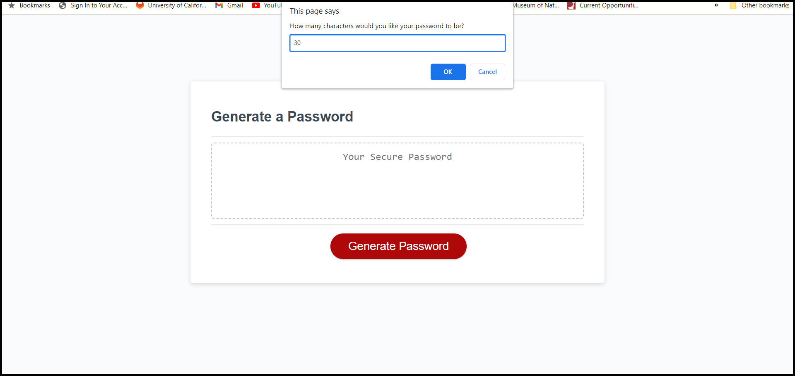
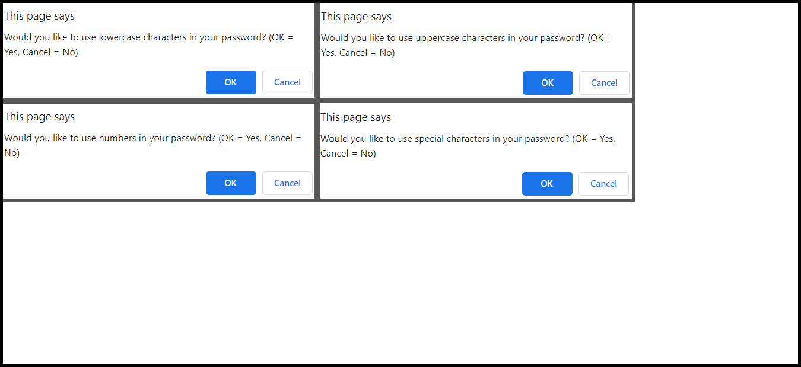
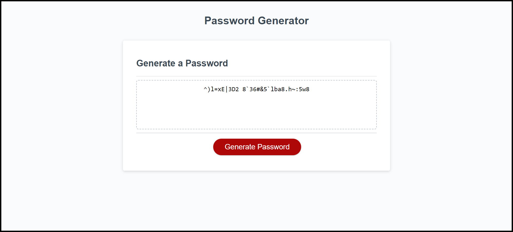

# Challenge 3: Dynamic Random Password Generator

## Description
An employee that has access to sensitive data might need to create a secure password that helps them protect the information they are working with. This project prompts the user to select up to four character types (lowercase, uppercase, numbers, and special characters) to include in their password. The output is a randomized password of a user-selected length, which can be used for login credentials. I learned how to use unicode to represent special characters, prompt the user until valid input is given, and work with an array of arrays.

## Installation
No installation is required for this project.

## Usage
The following images show the website's appearance:

## Credits
No collaboration took place for this project, but the following web resources helped me write the code and comments for this project:

1. [Special character unicode](https://owasp.org/www-community/password-special-characters)
2. [Using unicode to represent special characters](https://stackoverflow.com/questions/13093126/insert-unicode-character-into-javascript)
3. [How to exit when user clicks cancel button when prompted](https://stackoverflow.com/questions/12864582/javascript-prompt-cancel-button-to-terminate-the-function)
4. [How to prompt user until valid input is given](https://stackoverflow.com/questions/35044961/loop-that-prompts-user-until-valid-input)
5. [Creating an array of zeros](https://bobbyhadz.com/blog/javascript-create-array-of-zeros)
6. [Joining an array with no spaces](https://developer.mozilla.org/en-US/docs/Web/JavaScript/Reference/Global_Objects/Array/join)
7. [Meaning of hsl](https://www.w3schools.com/colors/colors_hsl.asp)
8. [Meaning of a in rgba](https://www.w3schools.com/css/css3_colors.asp#:~:text=RGBA%20color%20values%20are%20an,and%201.0%20(fully%20opaque))
9. [box-shadow properties](https://developer.mozilla.org/en-US/docs/Web/CSS/box-shadow)

## License
No license is attached to this project.
